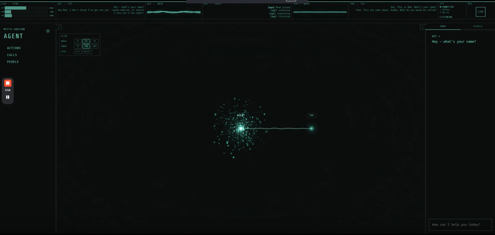
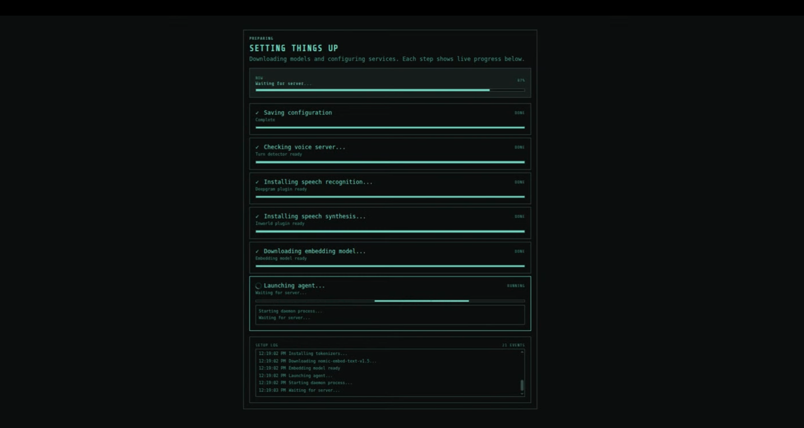

# Mystic Horizon (demo)

Prototype / demo copy of a personal local-first phone agent. Not a production service, not a company product, not 24/7 at scale.

This repo is a sanitized snapshot published as a hiring/portfolio sample. Agent homes, API keys, model weights, session logs, and identifying data are not included.

## Demo

[](https://www.loom.com/share/803780d4aa5342349cc6cdb3e74bed15)

[Watch the HUD demo on Loom](https://www.loom.com/share/803780d4aa5342349cc6cdb3e74bed15) — live transcript, traces, particle cloud, lightning tool-calls.

Initial setup (model download and service boot):



## What it does

The owner surface is a CRT phosphor HUD: live transcript, oscilloscope-style traces, provider ping, and the agent as a particle cloud with people in orbit. Tool calls flash as lightning on the graph. You talk to it over local LiveKit (mic and speakers) or optionally Twilio.

Behind the HUD:

- Stores transcripts, facts, actions, and people in local SQLite with FTS5 + sqlite-vec
- Extracts commitments after conversations and tracks them as actions
- Runs a scheduler that decides whether to act, wait, cancel, or escalate
- Bootstraps its identity from a real conversation during `init`

Hidden easter egg, last: a voice-driven asteroid game. The agent becomes the Belter copilot of the Slow Bell.

## Stack

| Layer | Choice |
|-------|--------|
| Runtime | Python 3.11+ |
| Server | `aiohttp` |
| CLI | `click` |
| Database | `sqlite3` + `sqlite-vec` + FTS5 |
| Phone | Twilio + LiveKit |
| Voice STT | Moonshine (local ONNX) |
| Voice TTS | Pocket TTS ONNX |
| LLM | OpenRouter or any OpenAI-compatible endpoint |
| Embeddings | Local ONNX (`nomic-embed-text-v1.5`) |
| Logging | `structlog` |

## Install

```bash
git clone https://github.com/gitdataboxes/mystic-horizon-demo
cd mystic-horizon-demo
bash scripts/bootstrap-python.sh
```

That creates `.venv/` and installs the package with dev dependencies.

Models download on init (Moonshine / Pocket TTS ONNX weights land under `~/.mystic-horizon/models/`). They are not vendored here.

Keys in env only. Do not commit `.env`, provider JSON, or Twilio credentials.

If you prefer manual setup:

```bash
python3 -m venv .venv
.venv/bin/python -m pip install -e ".[dev]"
```

## CLI

Use the installed console script or run through `.venv/bin/python -m mystic.cli`.

```bash
.venv/bin/mystic-horizon --agent <name> init
.venv/bin/mystic-horizon --agent <name> init --connect-twilio
.venv/bin/mystic-horizon --agent <name> start
.venv/bin/mystic-horizon --agent <name> stop
.venv/bin/mystic-horizon --agent <name> status
.venv/bin/mystic-horizon --agent <name> status --detail
.venv/bin/mystic-horizon status --all
.venv/bin/mystic-horizon --agent <name> dial +15551234567
.venv/bin/mystic-horizon --agent <name> chat
.venv/bin/mystic-horizon --agent <name> converse
```

## Tests

```bash
bash scripts/test-python.sh
```

Or:

```bash
.venv/bin/python -m pytest
```

## Project layout

```text
mystic/          Python package (HUD static lives in mystic/_assets/)
skills/          Shared SKILL.md files + Python handlers
prompts/         Seed prompt templates
voices/          Pocket TTS voice prompt wavs
tests/           Pytest suite
scripts/         Python bootstrap/test helpers
vendor/          Pocket TTS ONNX wrapper (downloads weights; no model files)
```

The bundled Pocket voice prompts are `.wav` clips in `voices/`, and new configs default to `Hades` via `voices/hades.wav`.

See `DESIGN.md` for the phosphor HUD language and `GRAPH.md` for the particle/graph surface.

## Data layout

Agent data lives under `~/.mystic-horizon/{agent-name}/` (outside this repo):

- `config/agent.json`
- `config/providers.json`
- `config/intelligence.json`
- `IDENTITY.md`
- `SOUL.md`
- `mystic-horizon.db`
- `faq/`
- `logs/`
