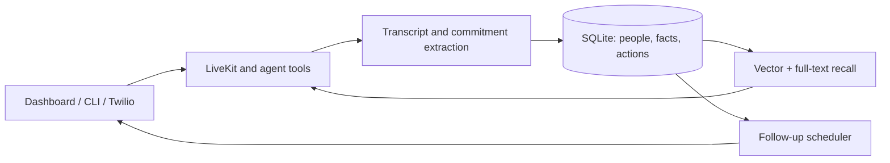

# Mystic Horizon — conversational memory and follow-up

[](https://github.com/gitdataboxes/mystic-horizon-demo/actions/workflows/checks.yml)

A local-first voice-agent prototype that remembers conversations, extracts commitments, and schedules follow-up actions—with a dashboard for inspecting people, transcripts, tools, and agent state.

Built with Python, LiveKit, SQLite hybrid retrieval, and local or cloud speech providers. This is a sanitized personal portfolio snapshot; production scale and uptime are not claimed.

## See it

[](https://www.loom.com/share/803780d4aa5342349cc6cdb3e74bed15)

[Watch the recorded dashboard demo](https://www.loom.com/share/803780d4aa5342349cc6cdb3e74bed15). The recording shows the interface; it is not a latency benchmark.

## The workflow

1. Talk or type through the owner dashboard, or connect a Twilio phone number.
2. Conversations become locally stored transcripts, facts, people, and commitments.
3. Hybrid retrieval brings relevant history back into later conversations.
4. A scheduler evaluates pending commitments and acts, waits, cancels, or escalates.
5. Inspect the resulting state and tool activity through the dashboard or CLI.



## What to inspect

| Capability | Implementation |
| --- | --- |
| Persistent memory, chunking, hybrid retrieval | [memory.py](mystic/memory.py), [db.py](mystic/db.py) |
| Action lifecycle, retries, scheduling | [actions.py](mystic/actions.py) |
| Speech adapters and tool-enabled conversations | [voice.py](mystic/voice.py), [worker.py](mystic/worker.py) |
| Audience-aware tool discovery and execution | [skills.py](mystic/skills.py) |
| Authenticated dashboard, live events, relationship views | [web.py](mystic/web.py) |
| Phone readiness and webhook handling | [phone.py](mystic/phone.py), [server.py](mystic/server.py) |
| Regression and integration coverage | [tests](tests), [verification notes](docs/VERIFICATION.md) |

## Try it locally

Use Python 3.11+ on Linux or macOS. First setup can download native binaries and model assets and may take several minutes. Live conversations need a configured LLM endpoint; local speech does not require a phone account.

```bash
git clone https://github.com/gitdataboxes/mystic-horizon-demo.git
cd mystic-horizon-demo
bash scripts/bootstrap-python.sh
.venv/bin/mystic-horizon --agent demo setup
```

Follow the browser setup flow to select providers and configure credentials. Local STT uses Moonshine; local TTS uses Pocket TTS ONNX. Deepgram STT and Inworld TTS are optional cloud alternatives. Twilio and Tailscale are optional for telephone access.


Setup allows 30 minutes by default. On a slow first download, extend it explicitly:

```bash
MH_SETUP_TIMEOUT_SECONDS=3600 .venv/bin/mystic-horizon --agent demo setup
```

Progress includes downloaded megabytes where available. A nonpositive timeout disables the setup watchdog. Speech providers without a native streaming method are adapted to the LiveKit streaming interface.

Useful commands after configuration:

```bash
.venv/bin/mystic-horizon --agent demo status --detail
.venv/bin/mystic-horizon --agent demo health
.venv/bin/mystic-horizon --agent demo people list
.venv/bin/mystic-horizon --agent demo actions list
.venv/bin/mystic-horizon --agent demo stop
```

## Decisions and tradeoffs

- **Local SQLite + FTS5 + sqlite-vec:** inspectable state in one file, with semantic and exact-term recall. This favors a personal agent over multi-tenant scale.
- **Local speech and embeddings:** more control over data processing, balanced against model downloads, hardware variation, and native runtime dependencies.
- **LiveKit + optional Twilio:** browser conversations and telephony share agent behavior, but media transport and turn handling add lifecycle complexity.
- **Explicit commitments and actions:** state can be inspected independently of a prompt. Extraction and scheduling judgments still require evaluation with representative conversations.
- **Dashboard visibility:** transcripts, tools, and relationships help explain what happened. Provider ping measures connection latency, not end-to-end conversational latency.

The earlier [TypeScript phone agent](https://github.com/gitdataboxes/phone-agent-demo) documents the Bun/Hono/VAPI architecture. [Mycelium](https://github.com/gitdataboxes/mycelium-demo) is a complementary full-stack community coordination project.

## Verify

```bash
bash scripts/test-python.sh
```

CI runs the non-benchmark suite and Python syntax compilation. Tests use isolated state and mocked providers. Hardware speech quality, real telephone calls, and sustained-load performance require separate manual checks; benchmarks are opt-in.

## Data and scope

Agent state and provider configuration live under `~/.mystic-horizon/<agent-name>/`; shared models live under `~/.mystic-horizon/models/`. Credentials may be saved in local provider configuration, so keep these directories private and outside version control.

Local-first describes storage and optional inference. Selected cloud LLM, STT, TTS, search, and telephony services receive the data necessary for those features. This demo excludes agent homes, session logs, keys, and model weights.

The visual design is documented in [DESIGN.md](DESIGN.md) and [GRAPH.md](GRAPH.md). A voice-controlled asteroid game is included as an optional interaction experiment.
